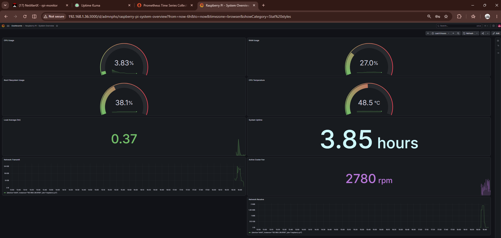
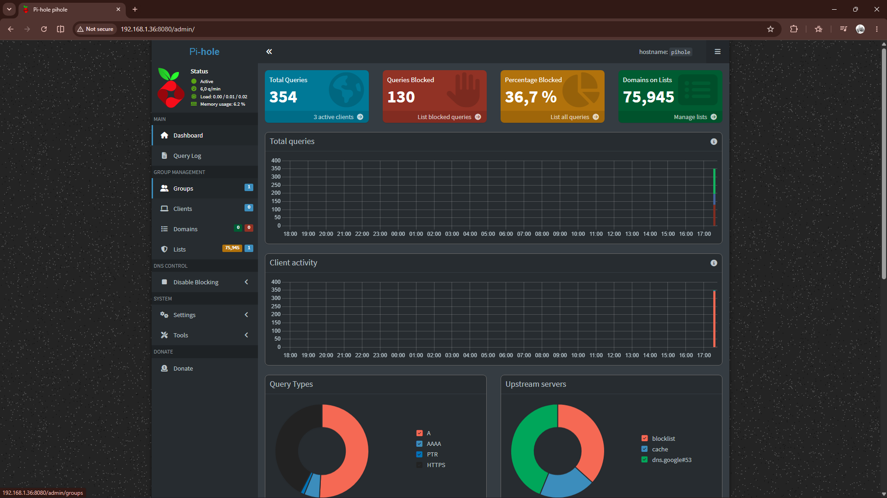
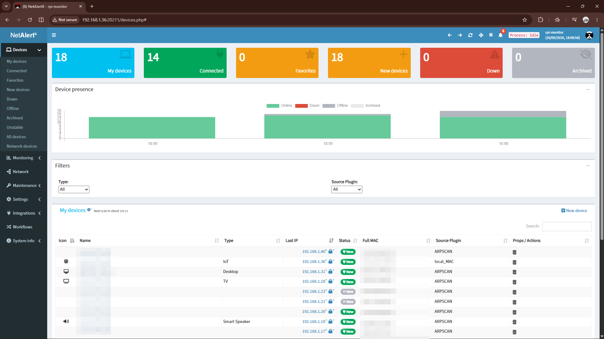
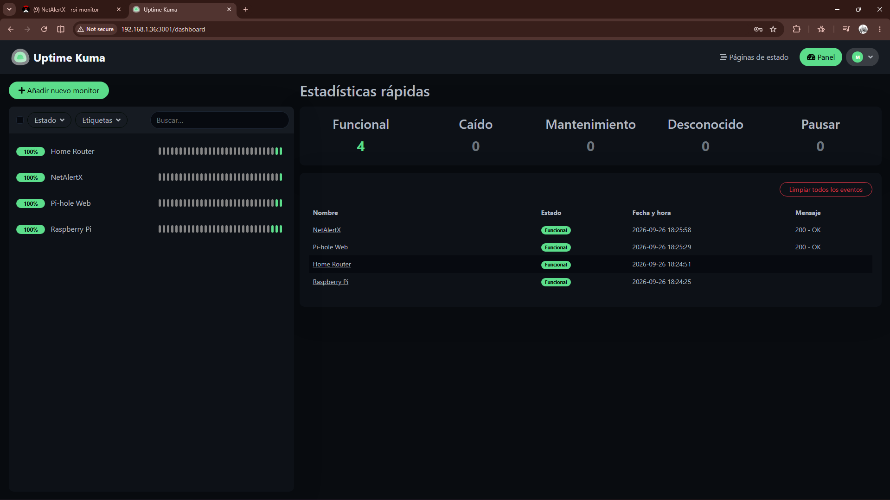
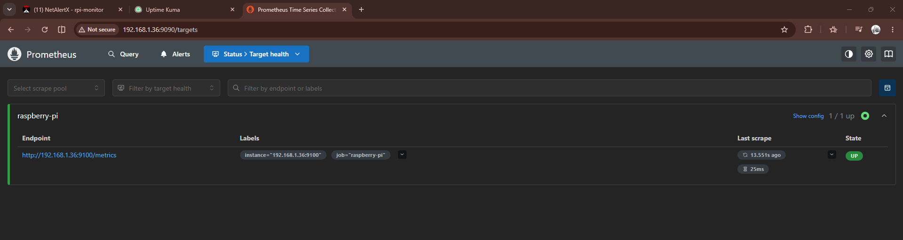
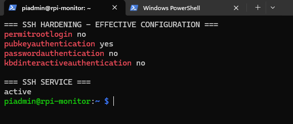
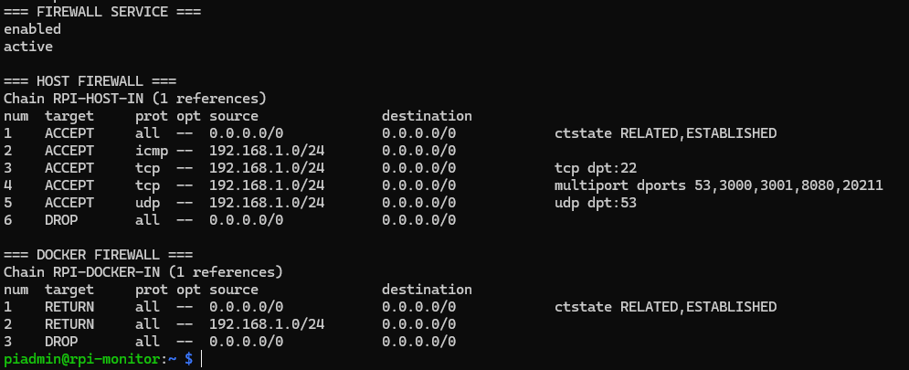
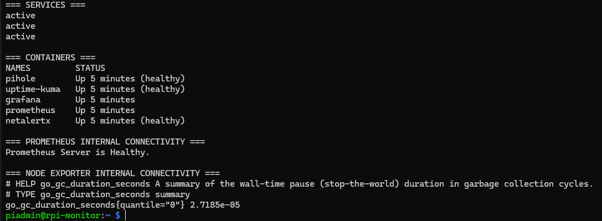

# Raspberry Pi Network Security & Monitoring

<p align="left">
  
  
  
  
  
  
  
</p>

A Raspberry Pi 5-based home network security and observability platform combining DNS filtering, device discovery, service monitoring, infrastructure metrics, dashboards, Linux hardening, Docker and network access controls.

## Key Features

- **DNS Security** — Pi-hole filtering for ads, trackers and unwanted domains with DNS query visibility.
- **Asset Visibility** — NetAlertX device discovery and LAN inventory using ARP-based scanning.
- **Service Monitoring** — Uptime Kuma checks the availability of critical network services.
- **Host Observability** — Prometheus + Node Exporter collect CPU, RAM, storage, uptime, network, temperature and fan metrics.
- **Custom Dashboards** — Grafana visualizes Raspberry Pi health using manually written PromQL queries.
- **Linux Hardening** — ED25519 SSH keys, disabled password login, restricted root access and reduced unnecessary services.
- **Network Access Control** — Custom firewall rules limit LAN exposure and keep backend services internal where possible.
- **Dockerized Deployment** — Reproducible services with persistent volumes and internal Docker networking.
- **Recovery Ready** — Validated backups, persistent application data and SHA256 integrity verification.



---

## What is this project?

Most home networks provide very little visibility.

Phones, laptops, smart TVs, consoles, IoT devices and servers can all connect to the same router, but there is usually no central place to answer questions such as:

- What devices are connected to the network?
- Has a new or unknown device appeared?
- What domains are clients trying to resolve?
- Can known advertising and tracking domains be blocked centrally?
- Are internal services currently available?
- Is the monitoring platform itself healthy?
- How much CPU, RAM, storage and network bandwidth is being used?
- Is the Raspberry Pi overheating?
- Will the monitoring stack recover automatically after a reboot?

This project turns a **Raspberry Pi 5 into a dedicated network security and monitoring platform** designed to answer those questions.

The Raspberry Pi does **not** replace the router and does **not** act as the Internet gateway. Instead, it adds a security and visibility layer to the local network.

```text
                           Internet
                              |
                              v
                         Home Router
                              |
               +--------------+--------------+
               |              |              |
             PCs          Mobile / IoT     Homelab
               |              |              |
               +--------------+--------------+
                              |
                       Raspberry Pi 5
                              |
          +-------------------+-------------------+
          |                   |                   |
       Pi-hole             NetAlertX          Monitoring
     DNS Security       Device Discovery          |
                                             +----+----+
                                             |         |
                                       Uptime Kuma  Prometheus
                                                       |
                                                  Node Exporter
                                                       |
                                                    Grafana
```

### In simple terms

| Tool | What question does it answer? |
|---|---|
| Pi-hole | What domains are devices resolving, and which known ad/tracker domains should be blocked? |
| NetAlertX | What devices are connected to the network? |
| Uptime Kuma | Are important network services currently reachable? |
| Prometheus | What metrics are being collected over time? |
| Node Exporter | How is the Raspberry Pi itself performing? |
| Grafana | How can those metrics be visualized clearly? |
| SSH hardening | How is remote administration protected? |
| Firewall | Which services are intentionally exposed, and which are restricted? |

The result is a small-scale implementation of concepts commonly found in professional infrastructure, blue-team and security-monitoring environments.

---

## Project Goals

The project was designed to demonstrate practical experience with:

- Raspberry Pi and Linux administration
- ARM64 systems
- Docker Engine and Docker Compose
- DNS security
- Network device discovery
- Service availability monitoring
- Prometheus metrics
- Grafana dashboards
- Linux system monitoring
- SSH key-based authentication
- Host hardening
- Firewall design
- Docker networking
- Persistent storage
- Backup and recovery
- Troubleshooting
- Security-focused documentation

---

## Hardware

| Component | Configuration |
|---|---|
| Platform | Raspberry Pi 5 |
| Memory | 4 GB RAM |
| Cooling | Raspberry Pi Active Cooler |
| Storage | SanDisk 32 GB microSD |
| Network | Gigabit Ethernet |
| Architecture | ARM64 / aarch64 |

Wired Ethernet is used as the primary interface because DNS, monitoring and device discovery benefit from a stable network path.

---

## Operating System

```text
Raspberry Pi OS Lite 64-bit
Debian 13 (Trixie)
ARM64
```

The Lite edition was selected to reduce unnecessary packages, resource consumption and attack surface. No desktop environment is required because administration is performed remotely over SSH.

---

## Network Baseline

```text
Raspberry Pi: 192.168.1.36
Network:      192.168.1.0/24
Gateway:      192.168.1.1
Interface:    eth0
```

The Raspberry Pi receives its address through DHCP, with a router-side DHCP reservation ensuring a stable IP.

---

## Docker Architecture

Most application services run in Docker.

```text
Raspberry Pi OS
|
+-- Host Services
|   |
|   +-- SSH
|   +-- Node Exporter
|   +-- Firewall
|
+-- Docker
    |
    +-- monitoring network
    |   |
    |   +-- Pi-hole
    |   +-- Uptime Kuma
    |   +-- Prometheus
    |   +-- Grafana
    |
    +-- host networking
        |
        +-- NetAlertX
```

**Node Exporter** runs directly on the host so it can measure the Raspberry Pi without mounting host system paths into a privileged container.

**NetAlertX** uses host networking because Layer 2 discovery mechanisms such as ARP require direct visibility of the local network.

---

## DNS Security with Pi-hole

Pi-hole provides DNS filtering and visibility.

Deployment was deliberately staged:

1. Pi-hole was deployed without changing client DNS.
2. DNS resolution was tested directly against Pi-hole.
3. A workstation was configured to use Pi-hole as its DNS resolver.
4. Normal browsing and DNS blocking were validated.

A normal query successfully resolved:

```text
example.com -> valid public IP addresses
```

A domain on the gravity list returned:

```text
doubleclick.net -> 0.0.0.0
EDE: 15 (Blocked)
```

This confirmed both normal DNS resolution and blocking behavior.



### Network-wide deployment capability

The architecture can be extended so that all household devices use Pi-hole as their DNS resolver.

If a router supports custom DNS distribution through DHCP, the Raspberry Pi address can be advertised automatically to clients. Some ISP-provided routers restrict this configuration. In those environments, possible approaches include:

- configuring selected clients manually;
- using Pi-hole as the DHCP server;
- deploying a router/firewall that offers full DHCP/DNS control;
- requesting suitable DNS/DHCP options from the ISP.

The project validated DNS filtering using a controlled client deployment before any broader rollout.

---

## Device Discovery with NetAlertX

NetAlertX provides visibility into devices connected to the local network.

ARP discovery was configured for:

```text
192.168.1.0/24 --interface=eth0
```

The platform successfully discovered and inventoried active LAN devices.



This provides a central place to review:

- known devices;
- newly discovered devices;
- online/offline state;
- private IP addresses;
- vendors;
- network changes.

---

## Availability Monitoring with Uptime Kuma

Uptime Kuma monitors key infrastructure components.

| Monitor | Check |
|---|---|
| Raspberry Pi | ICMP Ping |
| Home Router | ICMP Ping |
| Pi-hole Web | HTTP |
| NetAlertX | HTTP |



---

## Prometheus + Node Exporter

Node Exporter runs directly on the Raspberry Pi and exposes Linux host metrics.

Prometheus scrapes those metrics every 15 seconds.

Metrics include:

- CPU usage
- RAM usage
- filesystem usage
- system uptime
- load average
- network receive/transmit
- CPU temperature
- Active Cooler fan RPM

Prometheus is not exposed directly to LAN clients. Grafana accesses it over the internal Docker network:

```text
Grafana -> http://prometheus:9090 -> Prometheus
```



---

## Grafana Dashboard

A custom dashboard was built rather than importing a pre-built dashboard.


Panels include:

- CPU Usage
- RAM Usage
- Root Filesystem Usage
- System Uptime
- CPU Temperature
- Active Cooler Fan RPM
- Load Average
- Network Receive
- Network Transmit

---

## SSH Hardening

SSH hardening was performed only after key authentication had been successfully validated from a separate session.

```text
PermitRootLogin no
PubkeyAuthentication yes
PasswordAuthentication no
KbdInteractiveAuthentication no
```



---

## Network Exposure and Firewall

The final design follows a least-exposure approach.

```text
22/tcp      SSH              LAN accessible
53/tcp+udp  Pi-hole DNS      LAN accessible
3000/tcp    Grafana          LAN accessible
3001/tcp    Uptime Kuma      LAN accessible
8080/tcp    Pi-hole Web      LAN accessible
20211/tcp   NetAlertX Web    LAN accessible

9090/tcp    Prometheus       Docker internal only
9100/tcp    Node Exporter    blocked from LAN clients
20212/tcp   NetAlertX API    blocked from LAN clients
```

A dedicated iptables ruleset was implemented without modifying Docker-managed chains.



---

## Persistence and Recovery Validation

The complete platform was rebooted after deployment.

After reboot:

- Docker started automatically.
- Node Exporter started automatically.
- Firewall rules were restored.
- Pi-hole returned healthy.
- NetAlertX returned healthy.
- Uptime Kuma returned healthy.
- Prometheus restarted successfully.
- Grafana restarted successfully.
- Grafana retained its dashboard.
- Prometheus continued scraping Node Exporter.
- Pi-hole continued resolving DNS.



---

## Backup and Recovery

A private recovery backup was created after deployment.

The recovery set contains:

- Docker Compose configuration
- Prometheus configuration
- Docker persistent volumes
- Pi-hole state
- NetAlertX state
- Uptime Kuma state
- Prometheus data
- Grafana configuration and dashboards
- Node Exporter systemd service
- Firewall script and systemd service
- SSH hardening configuration
- Docker daemon configuration
- system version inventory
- Docker image inventory
- network baseline
- SHA256 integrity manifest

Application-state backups were created while containers were stopped to reduce the risk of inconsistent copies.

Secrets and persistent application data are excluded from the public GitHub repository.

---

## Troubleshooting Highlight

NetAlertX initially entered a restart loop because its read-only filesystem and `/tmp` tmpfs permissions prevented startup processes from creating required paths.

The issue was diagnosed from Docker logs.

Instead of using `privileged: true`, the container was corrected using aligned tmpfs ownership and a minimal capability set:

```text
NET_ADMIN
NET_RAW
NET_BIND_SERVICE
CHOWN
SETUID
SETGID
```

The container then started successfully and passed its health check.

See [troubleshooting/README.md](troubleshooting/README.md).

---

## Security Decisions

- Raspberry Pi OS Lite instead of a desktop image
- wired Ethernet as the primary interface
- ED25519 SSH key authentication
- SSH password authentication disabled
- root SSH login disabled
- unnecessary Bluetooth and Avahi services disabled
- Docker log rotation configured
- persistent named volumes
- Prometheus kept internal to Docker
- Node Exporter blocked from LAN clients
- NetAlertX backend API blocked from LAN clients
- secrets excluded from Git
- backups stored separately from the public repo
- host firewall rules kept separate from Docker-managed chains

---

## Repository Structure

```text
raspberry-pi-network-security-monitoring/
├── README.md
├── architecture/
├── docker/
├── docs/
├── setup/
├── hardening/
├── monitoring/
├── screenshots/
├── troubleshooting/
└── recovery/
```

---

## Future Improvements

Possible next steps include:

- network-wide DHCP DNS distribution
- secondary Pi-hole instance for DNS redundancy
- automatic notifications for newly discovered devices
- Uptime Kuma notifications
- Grafana/Prometheus alerting
- friendly local DNS records
- SSD/NVMe migration
- automated off-device backups
- VLAN/network-segmentation visibility
- local HTTPS/reverse proxy
- centralized syslog
- Splunk integration
- integration with the existing Home Cyber Range & Mini SOC Lab

A more production-oriented design would use two independent DNS resolvers so that DNS does not depend on a single Raspberry Pi.

---

## Skills Demonstrated

- Linux administration
- Raspberry Pi
- ARM64
- Docker
- Docker Compose
- DNS security
- Pi-hole
- Network discovery
- NetAlertX
- Service monitoring
- Uptime Kuma
- Prometheus
- Grafana
- Node Exporter
- PromQL
- SSH hardening
- Linux permissions
- Firewall rules
- Network troubleshooting
- Container troubleshooting
- Persistent storage
- Backup and recovery
- Security documentation
- Infrastructure monitoring

---

## Related Project ⭐

This project complements a separate **Home Cyber Range & Mini SOC Lab** focused on:

- Splunk
- Sysmon
- Suricata
- Cowrie
- Atomic Red Team
- MITRE ATT&CK
- detection engineering
- alerts
- incident investigation

The Raspberry Pi project focuses instead on network visibility, DNS security, infrastructure monitoring, Linux administration, Docker, availability and system hardening.

---

## Acknowledgements and Learning Resources 📖

This project was designed, built, configured, tested, and documented by me as a hands-on cybersecurity learning project.

During its development, I used a combination of official documentation, technical tutorials, open-source repositories, community resources, and AI-assisted guidance to support troubleshooting, research, configuration, and documentation.

All implementation decisions, lab configuration, testing, validation, analysis, and final documentation were reviewed and carried out by me within my own controlled environment.


---

**14nd3r**  
*Gracias por tu tiempo — Thanks for your time.*
