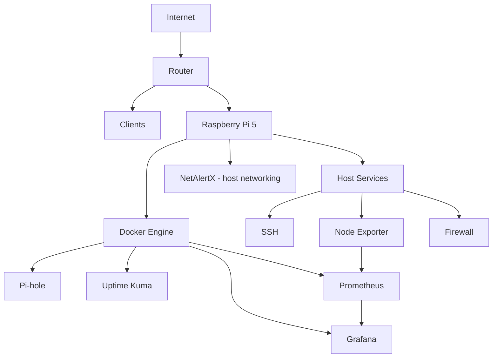

# Architecture

## Overview

The platform is designed as a dedicated security and observability node on the home LAN.

It does not route Internet traffic and is not positioned inline between clients and the router. This avoids turning the Raspberry Pi into an unnecessary network gateway or single point of failure for packet forwarding.

Its responsibilities are intentionally separated:

| Capability | Component |
|---|---|
| DNS filtering | Pi-hole |
| Asset discovery | NetAlertX |
| Availability monitoring | Uptime Kuma |
| Metrics collection | Prometheus |
| Host telemetry | Node Exporter |
| Visualization | Grafana |
| Secure administration | OpenSSH |
| Host access control | iptables-based firewall |

## Logical architecture

## Design principles

### Least exposure

Services are not published to the LAN unless a user or another network device needs direct access.

Prometheus is intentionally internal to Docker. Node Exporter and the NetAlertX backend API are filtered from LAN clients.

### Reproducibility

Application services use Docker Compose and named volumes. Host-level services such as Node Exporter and the firewall are managed by systemd.

### Separation of concerns

Each tool has one primary role. The project avoids adding tools that duplicate functionality without a clear reason.

### Progressive rollout

Changes with potential network impact, especially DNS, are tested first on a controlled client before considering broader deployment.

### Recoverability

Persistent application state and host configuration are backed up separately from the public repository.

## Host vs container placement

### Host services

- OpenSSH
- Node Exporter
- firewall
- NetworkManager
- system logging

Node Exporter runs on the host so it can observe the real Raspberry Pi system without broad host mounts inside a container.

### Docker bridge network

- Pi-hole
- Uptime Kuma
- Prometheus
- Grafana

These services benefit from container isolation and internal Docker DNS.

### Docker host networking

NetAlertX uses host networking because ARP-based discovery requires direct Layer 2 access to the LAN.

## Failure boundaries

The Raspberry Pi is not the Internet gateway.

If the monitoring stack fails:

- routing/NAT on the home router continues;
- LAN connectivity continues;
- monitoring dashboards become unavailable;
- Pi-hole clients configured to depend on this DNS resolver may temporarily lose DNS resolution.

For a permanent network-wide Pi-hole deployment, a second independent DNS resolver would be the preferred redundancy improvement.
