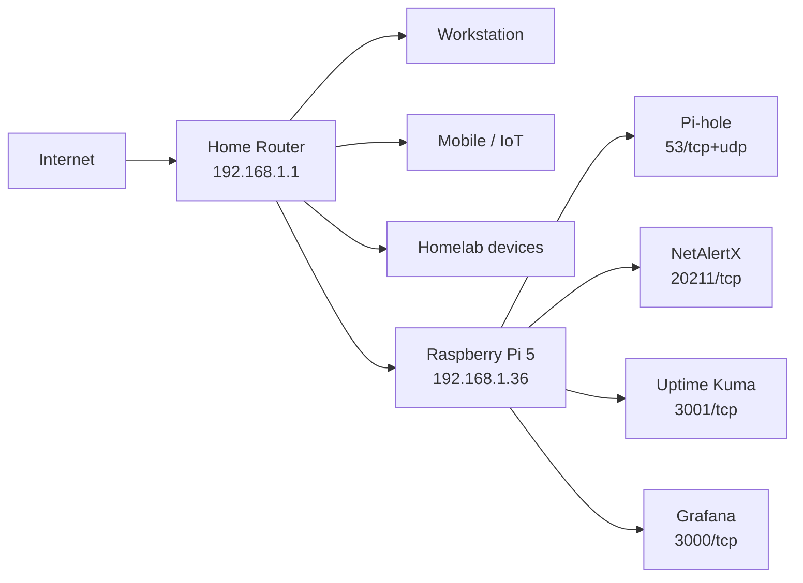

# Network Topology

## LAN baseline

```text
Network:      192.168.1.0/24
Gateway:      192.168.1.1
Raspberry Pi: 192.168.1.36
Interface:    eth0
```

The Raspberry Pi receives its address through DHCP with a router-side reservation.

## Topology



## Service exposure

| Port | Service | Exposure |
|---:|---|---|
| 22/tcp | SSH | LAN |
| 53/tcp | Pi-hole DNS | LAN |
| 53/udp | Pi-hole DNS | LAN |
| 3000/tcp | Grafana | LAN |
| 3001/tcp | Uptime Kuma | LAN |
| 8080/tcp | Pi-hole Web | LAN |
| 20211/tcp | NetAlertX Web | LAN |
| 9090/tcp | Prometheus | Docker internal |
| 9100/tcp | Node Exporter | not available to LAN clients |
| 20212/tcp | NetAlertX backend/API | not available to LAN clients |

## Docker internal network

The user-defined Docker network is named:

```text
monitoring
```

Grafana accesses Prometheus by Docker DNS name:

```text
http://prometheus:9090
```

This allows Prometheus to remain unpublished on the host.

## DNS deployment model

The tested client deployment uses:

```text
Client -> 192.168.1.36:53 -> Pi-hole -> upstream DNS
```

A LAN-wide rollout can be implemented when the DHCP infrastructure can distribute `192.168.1.36` as DNS to all clients.
